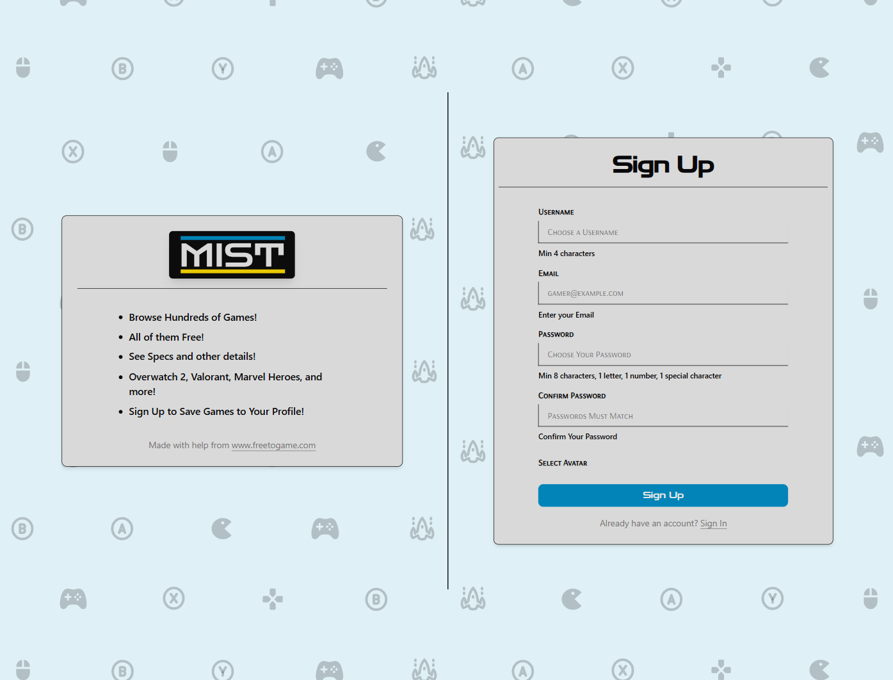
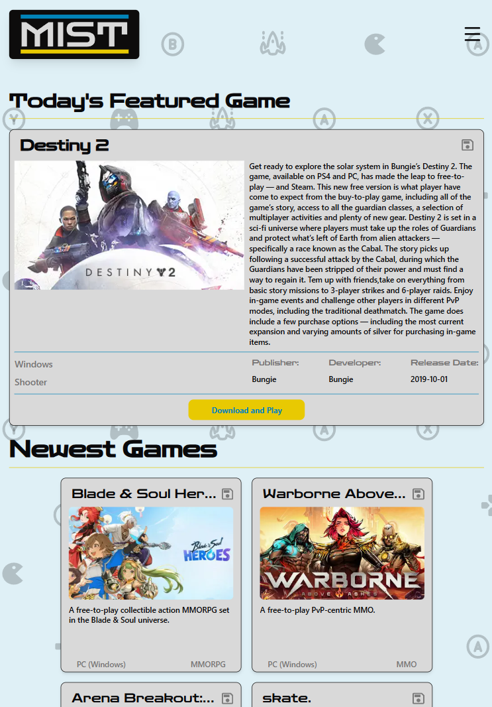

# MIST

[M I S T.com](https://mistfreegames.vercel.app/)

## Overview

This application for any gamer into PC gaming, giving them the ability to browse the best kinds of games: free ones! An API call is made to freetogame.com/api and free-to-play games are displayed in various ways, including search and filtering and a daily Featured Game. Users can register and log in to save games they have played and enjoyed!

-   Original Repo Links
-   Game API
-   Recent Updates
-   Preview Images
-   Future Updates

### Original Repo

[Frontend Repo](https://github.com/Weaver17/Mist-frontend)

[Backend Repo](https://github.com/Weaver17/Mist-backend)

### Free to Game API

[FreetoPlay's free API](https://www.freetogame.com/api-doc)

**Recent Updates**

-   MIST came to Next.js!

**Features**

-   **Next.js** – A React framework that provides hybrid static & server rendering, API routes, and full-stack capabilities with the new App Router.

-   **Tailwind CSS** – A utility-first CSS framework for rapidly building modern, responsive UIs with composable classes.

-   **Prisma** – A type-safe ORM for Node.js that simplifies database queries and schema management.

-   **PostgreSQL** – A robust, open-source relational database with strong SQL support and advanced features.

-   **Custom shadcn/ui components** – A customized collection of pre-built, accessible UI components built with Radix and styled using Tailwind.

-   **react-hook-form** – Lightweight form management for React with minimal re-renders and built-in validation.

-   **Zod** – A TypeScript-first schema declaration and validation library, great for type-safe form and API validation.

-   **Toast (sonner or radix-toast)** – Non-blocking UI notifications for feedback, errors, or status updates in your app.

-   **BetterAuth** – Authentication library for Next.js that provides secure, modern auth flows with minimal setup.

**Preview Images**

_Desktop_-

Home Page

Footer

Search Page

All Games Page

Game Page

Profile Page

Edit Dialog

Profile Sidebar

Sign In Page

Sign Up Page

_Tablet_-

Home Page

Search Page

All Games Page

Game Page

Profile Page

Sign In Page

Sign Up Page

_Mobile_-

Home Page

Search Page

All Games Page

Game Page

Profile Page

Mobile Menu

Sign In Page

Sign Up Page

**Future Updates**

-   Category page and sort games by category
